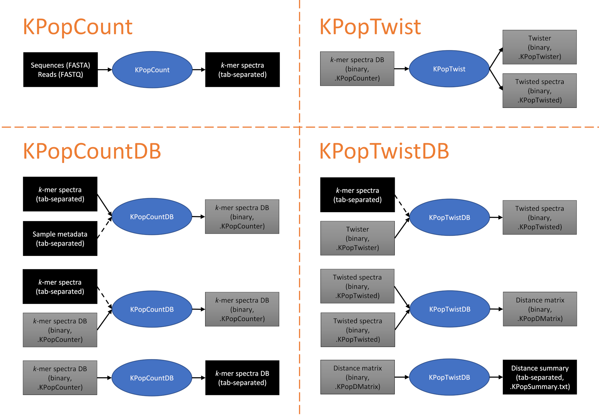

# `KPop`: Unleash the full power of your *k*-mers!

`KPop` is an assembly-free and scalable method for the comparative analysis of microbial genomes. It is based on full *k*-mer spectra and dataset-specific transformations, and allows for the accurate comparison of hundreds of thousands of assembled or unassembled microbial genomes in a matter of hours. More details can be found in our [bioRxiv preprint](https://www.biorxiv.org/content/10.1101/2022.06.22.497172v1).

`KPop` is mostly implemented in [OCaml](https://ocaml.org), an industry-strength functional statically-typed programming language that offers remarkable concision, symbolic power, robustness, compiled speed, and portability. Due mostly to historical, prototyping reasons, a small part of `KPoP` is still in R, although we hope to eventually migrate everything to OCaml. All programs, both OCaml and R, are parallelised and will automatically use as many CPUs as are available on your machine, in order to reduce as much as possible the wallclock time taken by your tasks.

Depending on the problem at hand, `KPop` analysis can require a relatively large amount of resources, memory in particular. That is a conscious design choice &mdash; it would be impossible to leverage the power of full *k*-mer spectra otherwise. If you need to explore datasets with millions of sequences, we recommend that you do so on a robustly sized HPC node. However, not everything is expensive &mdash; for instance, and similar to what happens with other big-data frameworks, while the "training" phase needed to create `KPop`-based classifiers is typically resource-intensive, in most cases the classifiers themselves can then be run on lower-end machines.

## Table of contents

[1. Installation](#1-installation)<br>
&emsp; [1.1. Conda channel](#11-conda-channel)<br>
&emsp; [1.2. Pre-compiled binaries](#12-pre-compiled-binaries)<br>
&emsp; [1.3. Manual install](#13-manual-install)<br>
[2. Quick start](#2-quick-start)<br>
[3. Overview of commands](#3-overview-of-commands)<br>
[4. Command line syntax](#4-command-line-syntax)<br>
&emsp; [4.1. `KPopCount`](#41-kpopcount)<br>
&emsp; [4.2. `KPopCountDB`](#42-kpopcountdb)<br>
&emsp; [4.3. `KPopTwist`](#43-kpoptwist)<br>
&emsp; [4.4. `KPopTwistDB`](#44-kpoptwistdb)<br>
[5. Examples](#5-examples)<br>
&emsp; [5.1. Sequence classification](#51-sequence-classification)<br>
&emsp; &emsp; [5.1.1. Classifier for simulated *M.tuberculosis* sequencing reads](#511-classifier-for-simulated-mtuberculosis-sequencing-reads)<br>
&emsp; &emsp; [5.1.2. Classifier for deep-sequencing *M.tuberculosis* samples](#512-classifier-for-deep-sequencing-mtuberculosis-samples)<br>
&emsp; &emsp; [5.1.3. Classifier for COVID-19 sequences (Hyena)](#513-classifier-for-covid-19-sequences-hyena)<br>
&emsp; [5.2. Relatedness engine](#52-relatedness-engine)<br>
&emsp; [5.3. Pseudo-phylogenetic trees](#53-pseudo-phylogenetic-trees)<br>

## 1. Installation

> :warning: Note that the only operating systems we officially support are Linux and MacOS. :warning:
>
> Both OCaml and R are highly portable and you might be able to manually compile/install everything successfully on other platforms (for instance, Windows) but you will have to do it yourself. 

There are several possible ways of installing the software on your machine: through `conda`; by downloading pre-compiled binaries (Linux and MacOS x86_64 only); or manually.

### 1.1. Conda channel

> :construction: Coming soon! :construction:

### 1.2. Pre-compiled binaries

You can download pre-compiled binaries for Linux and MacOS x86_64 from our [releases](https://github.com/PaoloRibeca/KPop/releases).

### 1.3. Manual install

Alternatively, you can install `KPop` manually by cloning and compiling its sources. You'll need an up-to-date distribution of the OCaml compiler and the [Dune package manager](https://github.com/ocaml/dune) for that. Both can be installed through [OPAM](https://opam.ocaml.org/), the official OCaml distribution system. Once you have a working OPAM distribution you'll also have a working OCaml compiler, and Dune can be installed with the command
```
$ opam install dune
```
if it is not already present. Make sure that you install OCaml version 4.12 or later.

Cloning should be done with the option --recursive, as in
```
$ git clone --recursive git@github.com:PaoloRibeca/KPop.git
```
so as to make sure that all the subrepositories get correctly pulled.

Then go to the directory into which you have downloaded the latest `KPop` sources, and type
```
$ ./BUILD
```

That should generate all the executables you'll need (as of this writing, `KPopCount`, `KPopCounterDB`, `KPopTwist_`, `KPopTwist`, `KPopTwistDB`) in the directory `./build`. Copy them to some favourite location in your PATH, for instance `~/.local/bin`.

For the time being, due to the presence of some legacy code, you'll also need to install some R packages (and possibly R itself) by using your favourite R package manager. Those packages are:
```
data.table
ca
```

## 2. Quick start

Download file `clusters-small.fasta` from the directory `test`. Then run the following commands (excluding prompt characters `$` at the beginning of each line):

```bash
$ export K=5
$ date
$ for CLASS in C1 C2 C3 C4 C5 C6 C7 C8 C9 C10; do cat clusters-small.fasta | awk -v CLASS="$CLASS" '{nr=(NR-1)%4; ok=(nr==0?$0~("-"CLASS"$"):nr==1&&ok); if (ok) print}' | KPopCount -l $CLASS -f /dev/stdin -k "$K" | KPopCountDB -f /dev/stdin -R "~." -A "$CLASS" -P -L "$CLASS" -N -P -D --table-transform none -t /dev/stdout 2> /dev/null; done | KPopCountDB -f /dev/stdin -o Classes -v
$ KPopTwist -i Classes
$ cat clusters-small.fasta | awk -v K="$K" '{nr=(NR-1)%4; if (nr==2) split($0,s,"[>-]"); if (nr==3) {command="KPopCount -l "s[2]"-"s[3]" -f /dev/stdin -k "K; print ">"s[2]"\n"$0 | command; close(command)}}' | KPopTwistDB -i T Classes -k /dev/stdin -d Classes -s Classes -v
$ echo -n "Misclassified sequences: "; cat Classes.KPopSummary.txt | tawk 'BEGIN{OFS="\t"} {$1=gensub("-","\"\t\"",1,$1); print}' | tawk '{if ($2!=$7) print}' | wc -l
$ date
```

That should produce an output such as this one:

```
Fri 14 Jul 11:58:45 BST 2023
This is the KPopCountDB program (version 0.31)
 (c) 2020-2023 Paolo Ribeca, <paolo.ribeca@gmail.com>
[1/1] File '/dev/stdin': Read 10 spectra on 10244 lines.
(Dune__exe__KPopCountDB.KMerDB.to_binary): Outputting DB to file 'Classes.KPopCounter'... done.
This is the KPopTwistDB program (version 0.18)
 (c) 2022 Paolo Ribeca, <paolo.ribeca@gmail.com>
(Dune__exe__KPopTwistDB.Twister.of_binary): Reading DB from file 'Classes.KPopTwister'... done.
[1/1] File '/dev/stdin': Read 500 spectra on 512088 lines.
(KPop__Matrix.of_binary): Reading DB from file 'Classes.KPopTwisted'... done.
(KPop__Matrix.Base.get_distance_rowwise): Done 5000/5000 elements=100%.
(KPop__Matrix.summarize_distance): Writing distance digest to file 'Classes.KPopSummary.txt': done 500/500 lines.
Misclassified sequences: 0
Fri 14 Jul 11:59:37 BST 2023
```

This is an example of `KPop`-based classifier. The input FASTA file `clusters-small.fasta` contains 1000 sequences having names such as `S2-C1`, meaning "sequence 2 belonging to class 1". There are 10 different classes. We will see things in more detail in the following sections, but, to summarise:
1. Sequences with an odd index are taken to be part of the training set, sequences with an even index are considered part of the test set
2. For each class `C1`, `C2`, ... `C10`, if the variable CLASS contains the name of the class, the command
   ```bash
   $ cat clusters-small.fasta | awk -v CLASS="$CLASS" '{nr=(NR-1)%4; ok=(nr==0?$0~("-"CLASS"$"):nr==1&&ok); if (ok) print}' | KPopCount -l $CLASS -f /dev/stdin -k "$K" | KPopCountDB -f /dev/stdin -R "~." -A "$CLASS" -P -L "$CLASS" -N -P -D --table-transform none -t /dev/stdout 2> /dev/null
   ```
   runs `KPopCount` (with *k*=5) on each training sequence belonging to CLASS; the results, which are text files each one containing a list of *k*-mers with their respective frequencies, are concatenated and sent to `KPopCountDB` through a pipe &mdash; if you wanted to look into the format, you could do so with the command
   ```bash
   $ cat clusters-small.fasta | awk -v CLASS="$CLASS" '{nr=(NR-1)%4; ok=(nr==0?$0~("-"CLASS"$"):nr==1&&ok); if (ok) print}' | KPopCount -l $CLASS -f /dev/stdin -k "$K" | less
   ```
   After that, `KPopCountDB` collects the spectra into a temporary database, replaces them with an average of the inputs named `$CLASS`, and re-outputs the averaged spectrum in the same format used before
3. The command
   ```bash
   $ KPopCountDB -f /dev/stdin -o Classes -v
   ```
   receives the 10 averaged spectra, one per class, and outputs them to a binary database called `Classes` (actually that corresponds to a file, which gets automatically named `Classes.KPopCounter`)
4. The command
   ```bash
   $ KPopTwist -i Classes
   ```
   "twists" spectra to a reduced-dimensionality space, storing the results in binary form (actually that corresponds to two files, which are automatically named `Classes.KPopTwister` and `Classes.KPopTwisted`). Both the twisted spectra and the "twister" &mdash; i.e., the operator that can be used to convert the original spectra to twisted space &mdash; are stored and can be reused later on
5. The command
   ```bash
   cat clusters-small.fasta | awk -v K="$K" '{nr=(NR-1)%4; if (nr==2) split($0,s,"[>-]"); if (nr==3) {command="KPopCount -l "s[2]"-"s[3]" -f /dev/stdin -k "K; print ">"s[2]"\n"$0 | command; close(command)}}' | KPopTwistDB -i T Classes -k /dev/stdin -d Classes -s Classes -v
   ```
   selects test sequences, runs each of them separately through `KPopCount` to produce a spectrum, and concatenates and pipes all the spectra thus generated to `KPopTwistDB`, which twists them according to the twister generated at the previous stage (named `Classes`). The results are output to a summary text file, which gets automatically named `Classes.KPopSummary.txt`. The file contains information about the two closest classes for each sequence
6. Finally the command
   ```bash
   $ echo -n "Misclassified sequences: "; cat Classes.KPopSummary.txt | tawk 'BEGIN{OFS="\t"} {$1=gensub("-","\"\t\"",1,$1); print}' | tawk '{if ($2!=$7) print}' | wc -l
   ```
   parses the results in `Classes.KPopSummary.txt` and computes the number of misclassified sequences.

## 3. Overview of commands

`KPop` comes as a number of different programs, which can be combined into complex workflows in a modular fashion. They are:
* [`KPopCount`](#41-kpopcount). It implements extraction of *k*-mer spectra from files containing sequences or sequencing reads (in FASTA format; and both single- and paired-end FASTQ format)
* [`KPopCountDB`](#42-kpopcountdb). It implements collection of *k*-mer spectra into binary databases, allowing the user to export the resulting objects as either binary files or text tables. Spectra can be transformed before export
* [`KPopTwist`](#43-kpoptwist). It implements the unsupervised generation of coordinate transformations (or "twisters") from databases of *k*-mer spectra. Each transformation is optimised for the database at hand, and turns ("twists") *k*-mer spectra into numerical vectors of a typically very much reduced dimensionality. The transformation can be stored as a binary object for future use
* [`KPopTwistDB`](#44-kpoptwistdb). It implements a number of operations on twisted spectra. It can: use an existing twister to twist *k*-mer spectra; generate databases of twisted spectra and output/input them as binary files or text tables; compute and summarise distances between twisted spectra; and more.

The following figure summarises the main typical data transformations that are possible and the file formats used to encode inputs and outputs in each case:



It should be noted that there are many more possible ways of using `KPopCountDB` and `KPopTwistDB`. For instance, with `KPopCountDB` it is possible to compute distances between untwisted *k*-mer spectra; with `KPopTwistDB` one can accumulate twisted *k*-mer spectra or distances into existing databases, and convert binary files from/to plain-text tab-separated tables. In the latter case, automatic naming rules are applied &mdash; for example, a command such as
```bash
$ KPopTwistDB ... -o t Classes
```
would result in the production of a binary file named `Classes.KPopTwisted` containing twisted *k*-mer spectra, while the command
```bash
$ KPopTwistDB ... -O t Classes
```
will produce the same results but output them to a tab-separated tabular file named `Classes.KPopTwisted.txt`. In general, in the style of BLAST indices, you do not have to worry about formats or extensions as long as you consistently use the same prefix (in this case, `Classes`) to indicate logically related files.

## 4. Command line syntax

### 4.1. `KPopCount`

This is the list of command line options available for the program `KPopCount`. You can visualise the list by typing
```bash
$ KPopCount -h
```
in your terminal. You will see a header containing information about the version:
```
This is the KPopCount program (version 0.6)
 (c) 2017-2022 Paolo Ribeca, <paolo.ribeca@gmail.com>
```
followed by detailed information. The general form the command can be used is:
```
KPopCount -l|--label <output_vector_label> [OPTIONS]
```

**Algorithmic parameters**

| Option | Argument(s) | Effect | Note(s) |
|-|-|-|-|
| `-k`<br>`-K`<br>`--k-mer-size`<br>`--k-mer-length` | _&lt;k\_mer\_length&gt;_ |  *k*\-mer length (must be positive, and &lt;= 30 for DNA or &lt;= 12 for protein) | <ins>default=<mark>_12_</mark></ins> |
| `-m`<br>`-M`<br>`--max-results-size` | _&lt;positive\_integer&gt;_ |  maximum number of *k*\-mer signatures to be kept in memory at any given time\.<br>If more are present, the ones corresponding to the lowest cardinality will be removed from memory and printed out, and there will be repeated signatures in the output | <ins>default=<mark>_16777216_</mark></ins> |

**Input/Output**

| Option | Argument(s) | Effect | Note(s) |
|-|-|-|-|
| `-c`<br>`-C`<br>`--content`<br>`--mode` | _'DNA'&#124;'protein'_ |  how file contents should be interpreted | <ins>default=<mark>_DNA_</mark></ins> |
| `-f`<br>`-F`<br>`--fasta` | _&lt;fasta\_file\_name&gt;_ |  FASTA input file containing sequences |  |
| `-s`<br>`-S`<br>`--single-end` | _&lt;fastq\_file\_name&gt;_ |  FASTQ input file containing single\-end sequencing reads |  |
| `-p`<br>`-P`<br>`--paired-end` | _&lt;fastq\_file\_name1&gt; &lt;fastq\_file\_name2&gt;_ |  FASTQ input files containing paired\-end sequencing reads |  |
| `-l`<br>`--label` | _&lt;output\_vector\_label&gt;_ |  label of the *k*\-mer vector in the output file | *(mandatory)* |
| `-o`<br>`--output` | _&lt;output\_file\_name&gt;_ |  name of generated output file | <ins>default=<mark>_&lt;stdout&gt;_</mark></ins> |

**Miscellaneous**

| Option | Argument(s) | Effect | Note(s) |
|-|-|-|-|
| `-v`<br>`--verbose` |  |  set verbose execution | <ins>default=<mark>_false_</mark></ins> |
| `-h`<br>`--help` |  |  print syntax and exit |  |

### 4.2. `KPopCountDB`

This is the list of command line options available for the program `KPopCountDB`. You can visualise the list by typing
```bash
$ KPopCountDB -h
```
in your terminal. You will see a header containing information about the version:
```
This is the KPopCountDB program (version 0.30)
 (c) 2020-2022 Paolo Ribeca, <paolo.ribeca@gmail.com>
```
followed by detailed information. The general form the command can be used is:
```
KPopCountDB [ACTIONS]
```

**Actions.**
They are executed delayed and in order of specification.

Actions on the database register:

| Option | Argument(s) | Effect | Note(s) |
|-|-|-|-|
| `-e`<br>`--empty` |  |  put an empty database into the register |  |
| `-i`<br>`--input` | _&lt;binary\_file\_prefix&gt;_ |  load to the register the database present in the specified file  (which must have extension `.KPopCounter`) |  |
| `-m`<br>`--metadata`<br>`--add-metadata` | _&lt;metadata\_table\_file\_name&gt;_ |  add to the database present in the register metadata from the specified file |  |
| `-f`<br>`--files`<br>`--add-files` | _&lt;k\-mer\_table\_file\_name&gt;\[','\.\.\.','&lt;k\-mer\_table\_file\_name&gt;\]_ |  add to the database present in the register *k*\-mers from the specified files |  |
| `--summary` |  |  print a summary of the database present in the register |  |
| `-o`<br>`--output` | _&lt;binary\_file\_prefix&gt;_ |  dump the database present in the register to the specified file  (which will be given extension `.KPopCounter`) |  |
| `--distance`<br>`--distance-function`<br>`--set-distance`<br>`--set-distance-function` | _'euclidean'&#124;'minkowski\(&lt;non\_negative\_float&gt;\)'_ |  set the function to be used when computing distances\.<br>The parameter for Minkowski is the power | <ins>default=<mark>_euclidean_</mark></ins> |
| `-d`<br>`--distances`<br>`--compute-distances`<br>`--compute-distances-spectral` | _&lt;binary\_file\_prefix&gt;_ |  compute distances between all the spectra present in the register  (the result will have extension `.KPopDMatrix`) |  |
| `--table-emit-row-names` | _'true'&#124;'false'_ |  whether to emit row names for the database present in the register when writing it as a tab\-separated file | <ins>default=<mark>_true_</mark></ins> |
| `--table-emit-col-names` | _'true'&#124;'false'_ |  whether to emit column names for the database present in the register when writing it as a tab\-separated file | <ins>default=<mark>_true_</mark></ins> |
| `--table-emit-metadata` | _'true'&#124;'false'_ |  whether to emit metadata for the database present in the register when writing it as a tab\-separated file | <ins>default=<mark>_false_</mark></ins> |
| `--table-transpose` | _'true'&#124;'false'_ |  whether to transpose the database present in the register before writing it as a tab\-separated file  (if `true` : rows are vector names, columns are (metadata and) *k*\-mer names;   if `false`: rows are (metadata and) *k*\-mer names, columns are vector names) | <ins>default=<mark>_false_</mark></ins> |
| `--table-threshold` | _&lt;non\_negative\_integer&gt;_ |  set to zero all counts that are less than this threshold before transforming and outputting them | <ins>default=<mark>_1_</mark></ins> |
| `--table-power` | _&lt;non\_negative\_float&gt;_ |  raise counts to this power before transforming and outputting them\.<br>A power of 0 when the `pseudocount` method is used performs a logarithmic transformation | <ins>default=<mark>_1\._</mark></ins> |
| `--table-transform`<br>`--table-transformation` | _'none'&#124;'normalize'&#124;'pseudocount'&#124;'clr'_ |  transformation to apply to table elements before outputting them | <ins>default=<mark>_normalize_</mark></ins> |
| `--table-emit-zero-rows` | _'true'&#124;'false'_ |  whether to emit rows whose elements are all zero when writing the database as a tab\-separated file | <ins>default=<mark>_false_</mark></ins> |
| `--table-set-precision` | _&lt;positive\_integer&gt;_ |  set the number of precision digits to be used when outputting counts | <ins>default=<mark>_15_</mark></ins> |
| `-t`<br>`--table` | _&lt;file\_prefix&gt;_ |  write the database present in the register as a tab\-separated file  (rows are *k*\-mer names, columns are vector names;   the file will be given extension `.KPopCounter.txt`) |  |

Actions involving the selection register:

| Option | Argument(s) | Effect | Note(s) |
|-|-|-|-|
| `-L`<br>`--labels`<br>`--selection-from-labels` | _&lt;vector\_label&gt;\[','\.\.\.','&lt;vector\_label&gt;\]_ |  put into the selection register the specified labels |  |
| `-R`<br>`--regexps`<br>`--selection-from-regexps` | _&lt;metadata\_field&gt;'\~'&lt;regexp&gt;\[','\.\.\.','&lt;metadata\_field&gt;'\~'&lt;regexp&gt;\]_ |  put into the selection register the labels of the vectors whose metadata fields match the specified regexps\.<br>An empty metadata field matches the labels |  |
| `-A`<br>`--add-sum-selection`<br>`--selection-add-sum` | _&lt;new\_vector\_label&gt;_ |  add to the database present in the register (or replace if the new label exists) a linear combination of the vectors whose labels are in the selection register |  |
| `-D`<br>`--delete`<br>`--selection-remove` |  |  remove from the table the vectors whose labels are in the selection register |  |
| `-N`<br>`--selection-negate` |  |  negate the labels that are present in the selection register |  |
| `-P`<br>`--selection-print` |  |  print the labels that are present in the selection register |  |
| `-C`<br>`--selection-clear` |  |  purge the selection register |  |
| `-F`<br>`--selection-to-table-filter` |  |  filters out vectors whose labels are present in the selection register when writing the database as a tab\-separated file |  |

**Miscellaneous options.**
They are set immediately

| Option | Argument(s) | Effect | Note(s) |
|-|-|-|-|
| `-T`<br>`--threads` | _&lt;computing\_threads&gt;_ |  number of concurrent computing threads to be spawned  (default automatically detected from your configuration) | <ins>default=<mark>_nproc_</mark></ins> |
| `-v`<br>`--verbose` |  |  set verbose execution | <ins>default=<mark>_false_</mark></ins> |
| `-h`<br>`--help` |  |  print syntax and exit |  |

### 4.3. `KPopTwist`

This is the list of command line options available for the program `KPopTwist`. You can visualise the list by typing
```bash
$ KPopTwist -h
```
in your terminal. You will see a header containing information about the version:
```
This is the KPopTwist program (version 0.14)
 (c) 2022 Paolo Ribeca, <paolo.ribeca@gmail.com>
```
followed by detailed information. The general form the command can be used is:
```
KPopTwist -i|--input <input_table_prefix> [OPTIONS]
```

**Algorithmic parameters**

| Option | Argument(s) | Effect | Note(s) |
|-|-|-|-|
| `-f`<br>`-F`<br>`-s`<br>`-S`<br>`--fraction`<br>`--sampling`<br>`--sampling-fraction` | _&lt;non\_negative\_float&gt;_ |  fraction of the rows to be considered and resampled before twisting | <ins>default=<mark>_1\._</mark></ins> |
| `--threshold` | _&lt;non\_negative\_integer&gt;_ |  set to zero all counts that are less than this threshold before transforming them | <ins>default=<mark>_1_</mark></ins> |
| `--power` | _&lt;non\_negative\_float&gt;_ |  raise counts to this power before transforming them\.<br>A power of 0 when the `pseudocount` method is used performs a logarithmic transformation | <ins>default=<mark>_1\._</mark></ins> |
| `--transform`<br>`--transformation` | _'none'&#124;'normalize'&#124;'pseudocount'&#124;'clr'_ |  transformation to apply to table elements | <ins>default=<mark>_normalize_</mark></ins> |

**Input/Output**

| Option | Argument(s) | Effect | Note(s) |
|-|-|-|-|
| `-i`<br>`--input` | _&lt;input\_table\_prefix&gt;_ |  load the specified *k*\-mer database in the register and twist it\.<br>File extension is automatically determined  (will be `.KPopCounter`)\.<br>The prefix is then re\-used for output  (and the output file will be given prefix `.KPopTwisted`) | *(mandatory)* |

**Miscellaneous**

| Option | Argument(s) | Effect | Note(s) |
|-|-|-|-|
| `-T`<br>`--threads` | _&lt;computing\_threads&gt;_ |  number of concurrent computing threads to be spawned  (default automatically detected from your configuration) | <ins>default=<mark>_nproc_</mark></ins> |
| `-v`<br>`--verbose` |  |  set verbose execution | <ins>default=<mark>_false_</mark></ins> |
| `-h`<br>`--help` |  |  print syntax and exit |  |

### 4.4. `KPopTwistDB`

This is the list of command line options available for the program `KPopTwistDB`. You can visualise the list by typing
```bash
$ KPopTwistDB -h
```
in your terminal. You will see a header containing information about the version:
```
This is the KPopTwistDB program (version 0.18)
 (c) 2022 Paolo Ribeca, <paolo.ribeca@gmail.com>
```
followed by detailed information. The general form the command can be used is:
```
KPopTwistDB [ACTIONS]
```

**Actions.**
They are executed delayed and in order of specification.

| Option | Argument(s) | Effect | Note(s) |
|-|-|-|-|
| `-e`<br>`--empty` | _T&#124;t&#124;d_ |  load an empty twisted database into the specified register  (`T`=twister; `t`=twisted; `d`=distance) |  |
| `-i`<br>`--input` | _T&#124;t&#124;d &lt;binary\_file\_prefix&gt;_ |  load the specified binary database into the specified register  (`T`=twister; `t`=twisted; `d`=distance)\.<br>File extension is automatically determined depending on database type  (will be: `.KPopTwister`; `.KPopTwisted`; or `.KPopDMatrix`, respectively) |  |
| `-I`<br>`--Input` | _T&#124;t&#124;d &lt;table\_file\_prefix&gt;_ |  load the specified tabular database(s) into the specified register  (`T`=twister; `t`=twisted; `d`=distance)\.<br>File extension is automatically determined depending on database type  (will be: `.KPopTwister.txt` and `.KPopInertia.txt`; `.KPopTwisted.txt`;   or `.KPopDMatrix.txt`, respectively) |  |
| `-a`<br>`--add` | _t&#124;d &lt;binary\_file\_prefix&gt;_ |  add the contents of the specified binary database to the specified register  (`t`=twisted; `d`=distance)\.<br>File extension is automatically determined depending on database type  (will be: `.KPopTwisted`; or `.KPopDMatrix`, respectively) |  |
| `-A`<br>`--Add` | _t&#124;d &lt;table\_file\_prefix&gt;_ |  add the contents of the specified tabular database to the specified register  (`t`=twisted; `d`=distance)\.<br>File extension is automatically determined depending on database type  (will be: `.KPopTwisted.txt`; or `.KPopDMatrix.txt`, respectively) |  |
| `-k`<br>`-K`<br>`--kmers`<br>`--add-kmers`<br>`--add-kmer-files` | _&lt;k\-mer\_table\_file\_name&gt;[','\.\.\.','&lt;k\-mer\_table\_file\_name&gt;]_ |  twist *k*\-mers from the specified files through the transformation present in the twister register, and add the results to the database present in the twisted register |  |
| `--distance`<br>`--distance-function`<br>`--set-distance`<br>`--set-distance-function` | _'euclidean'&#124;<br> 'minkowski(&lt;non\_negative\_float&gt;)'_ |  set the function to be used when computing distances\.<br>The parameter for Minkowski is the power | <ins>default=<mark>_euclidean_</mark></ins> |
| `-m`<br>`--metric`<br>`--metric-function`<br>`--set-metric`<br>`--set-metric-function` | _'flat'&#124;<br> 'power('&lt;non\_negative\_float&gt;')'&#124;<br> 'sigmoid('SIGMOID\_PARAMETERS')'_ |  where SIGMOID\_PARAMETERS :=  &lt;non\_negative\_float&gt;','&lt;non\_negative\_float&gt;','  &lt;non\_negative\_float&gt;','&lt;non\_negative\_float&gt; : set the metric function to be used when computing distances\.<br>Parameters are:  power; thresholding multiplier; left and right sigmoid tightnesses\. | <ins>default=<mark>_sigmoid(1,3,10,10)_</mark></ins> |
| `-d`<br>`--distances`<br>`--compute-distances`<br>`--compute-distances-twisted` | _&lt;twisted\_binary\_file\_prefix&gt;_ |  compute distances between all the vectors present in the twisted register and all the vectors present in the specified twisted binary file  (which must have extension `.KPopTwisted`)\.<br>The result will be placed in the distance register |  |
| `-o`<br>`--output` | _T&#124;t&#124;d &lt;binary\_file\_prefix&gt;_ |  dump the database present in the specified register  (`T`=twister; `t`=twisted; `d`=distance) to the specified binary file\.<br>File extension is automatically determined depending on database type  (will be: `.KPopTwister`; `.KPopTwisted`; or `.KPopDMatrix`, respectively) |  |
| `--precision`<br>`--set-precision`<br>`--set-table-precision` | _&lt;positive\_integer&gt;_ |  set the number of precision digits to be used when outputting numbers | <ins>default=<mark>_15_</mark></ins> |
| `-O`<br>`--Output` | _T&#124;t&#124;d&#124;m &lt;table\_file\_prefix&gt;_ |  dump the database present in the specified register  (`T`=twister; `t`=twisted; `d`=distance; `m`=metrics) to the specified tabular file(s)\.<br>File extension is automatically determined depending on database type  (will be: `.KPopTwister.txt` and `.KPopInertia.txt`; `.KPopTwisted.txt`;   `.KPopDMatrix.txt`; or `.KPopMetrics.txt`, respectively) |  |
| `--keep-at-most`<br>`--set-keep-at-most`<br>`--summary-keep-at-most` | _&lt;positive\_integer&gt;&#124;all_ |  set the maximum number of closest target sequences to be kept when summarizing distances | <ins>default=<mark>_2_</mark></ins> |
| `-s`<br>`--summarize-distances` | _&lt;summary\_file\_prefix&gt;_ |  summarize the distances present in the distance register and write the result to the specified tabular file\.<br>File extension will be automatically determined  (will be `.KPopSummary.txt`) |  |

**Miscellaneous options.**
They are set immediately.

| Option | Argument(s) | Effect | Note(s) |
|-|-|-|-|
| `-T`<br>`--threads` | _&lt;computing\_threads&gt;_ |  number of concurrent computing threads to be spawned  (default automatically detected from your configuration) | <ins>default=<mark>_nproc_</mark></ins> |
| `-v`<br>`--verbose` |  |  set verbose execution | <ins>default=<mark>_false_</mark></ins> |
| `-h`<br>`--help` |  |  print syntax and exit |  |

## 5. Examples

By using the programs just described, it is possible to implement a number of interesting high-throughput workflows. We illustrate some examples here - for a more general description, please refer to our [bioRxiv preprint](https://www.biorxiv.org/content/10.1101/2022.06.22.497172v1).

### 5.1. Sequence classification

One can implement a sequence classifier, starting from either a set of genomic sequences or a deep-sequencing dataset containing multiple samples, by using the following strategy:


Shortly, one first generates a collection of spectra that describe the "classes" understood by the classifier; from the classes a "twister", i.e. a specialised transformation, is derived; the twister is then used to transform new sequences; and distances are computed and summarised between the twisted spectra for the classes and the twisted spectra for the sequences in order to understand what is the class closest to each sequence (possibly with some additional statistical refinement).

Note that the classifier should be generated according to the data type of the input, i.e., you should not use a classifier trained on genomic sequences to process NGS samples or vice-versa. Doing so might occasionally work if contaminations are low and the sequencing bias is reasonably flat along the sequence, but in order to get consistent results significant post-processing might be needed.

#### 5.1.1. Classifier for simulated *M.tuberculosis* sequencing reads

As described in our [bioRxiv preprint](https://www.biorxiv.org/content/10.1101/2022.06.22.497172v1), we simulated sequencing reads for 1,000 *M.tuberculosis* genomes. The data thus generated is large (~127 GB) and hence we are not making it directly available for download. However, the scripts used to (re-)generate it can be found in the [`test`](https://github.com/PaoloRibeca/KPop/tree/main/test) directory of this repository.

##### 5.1.1.1. Data preparation

In the following, we assume that the input files derived from the simulation have been organised into directories relative to your current location, and their placement reflects the set (training/test) and sequence cluster each sample belongs to.

So, we'll have two directories,
```
Train/
Test/
```
and each directory will contain subdirectories, one for each sequence cluster:
```
Train/1
Train/2
...
Train/10
```
For instance, directory `Train/8` will contain input files for all the samples used as training data for sequence class `8`, and command
```bash
$ ls Train/8
```
will return
```
683_1.fastq  691_1.fastq  699_1.fastq  707_1.fastq  715_1.fastq  723_1.fastq  731_1.fastq  739_1.fastq  747_1.fastq
755_1.fastq  763_1.fastq  771_1.fastq  779_1.fastq  683_2.fastq  691_2.fastq  699_2.fastq  707_2.fastq  715_2.fastq
723_2.fastq  731_2.fastq  739_2.fastq  747_2.fastq  755_2.fastq  763_2.fastq  771_2.fastq  779_2.fastq  685_1.fastq
693_1.fastq  701_1.fastq  709_1.fastq  717_1.fastq  725_1.fastq  733_1.fastq  741_1.fastq  749_1.fastq  757_1.fastq
765_1.fastq  773_1.fastq  781_1.fastq  685_2.fastq  693_2.fastq  701_2.fastq  709_2.fastq  717_2.fastq  725_2.fastq
733_2.fastq  741_2.fastq  749_2.fastq  757_2.fastq  765_2.fastq  773_2.fastq  781_2.fastq  687_1.fastq  695_1.fastq
703_1.fastq  711_1.fastq  719_1.fastq  727_1.fastq  735_1.fastq  743_1.fastq  751_1.fastq  759_1.fastq  767_1.fastq
775_1.fastq  783_1.fastq  687_2.fastq  695_2.fastq  703_2.fastq  711_2.fastq  719_2.fastq  727_2.fastq  735_2.fastq
743_2.fastq  751_2.fastq  759_2.fastq  767_2.fastq  775_2.fastq  783_2.fastq  689_1.fastq  697_1.fastq  705_1.fastq
713_1.fastq  721_1.fastq  729_1.fastq  737_1.fastq  745_1.fastq  753_1.fastq  761_1.fastq  769_1.fastq  777_1.fastq
689_2.fastq  697_2.fastq  705_2.fastq  713_2.fastq  721_2.fastq  729_2.fastq  737_2.fastq  745_2.fastq  753_2.fastq
761_2.fastq  769_2.fastq  777_2.fastq
```
A similar structure will have been put in place for test data under the `Test/` directory, with files equally split under `Train/` and `Test/` for cross-validation purposes (however, different choices would be possible). This conventional arrangement will be assumed in the rest of this document for all the examples involving `KPop`-based classifiers.

##### 5.1.1.2. Data analysis

In order to analyse sequences in parallel fashion and decrease waiting times, we first prepare a short `bash` script named `process_classes`, as follows:
```bash
#!/usr/bin/env bash

while read DIR; do
  CLASS=$(echo "$DIR" | awk '{l=split(gensub("[/]+$","",1),s,"/"); print s[l]}')
  echo "Processing class '${CLASS}'..." > /dev/stderr
  ls "$DIR"/*_1.fastq |
    Parallel --lines-per-block 1 -- awk '{l=split($0,s,"/"); system("KPopCount -k 12 -l "gensub("_1.fastq$","",1,s[l])" -p "$0" "gensub("_1.fastq$","_2.fastq",1))}' |
    KPopCountDB -f /dev/stdin -R "~." -A "$CLASS" -P -L "$CLASS" -N -P -D --summary --table-transform none -t /dev/stdout 2> /dev/null
done
```
The program `Parallel` can be obtained from the [BiOCamLib repository](https://github.com/PaoloRibeca/BiOCamLib). on which the implementation of `KPop` depends.

The script takes as input a list of directories. For each directory, the script generates the 10-mer spectra for all the files contained in that directory, combines the spectra into an in-memory `KPopCount` database, generates their linear combination, discards the database, and writes the combination to standard output.

So, for instance,
```bash
$ echo Train/8 | ./process_classes
```
would process all files present in directory `Train/8`.

Note that the script is implicitly parallelised, in that both `Parallel` and `KPopCountDB` will automatically check for the number of available processors, and start an adequate number of computing threads to take full advantage of them. `KPopCount` is not by itself parallel, but multiple copies of it will be invoked through `Parallel`.

At this point, in order to perform the "training" phase, we need to issue the two commands
```bash
$ ls -d Train/*/ | Parallel --lines-per-block 1 -- ./process_classes | KPopCountDB -f /dev/stdin -o Classes
$ KPopTwist -i Classes
```
The first command will generate one combined, representative spectrum for each class in the training set, and subsequently, thanks to `KPopCountDB`, combine the spectra for all the representatives into a database having prefix `Classes` and full name `Classes.KPopCounter`.

The second command will "twist" the database, i.e., generate a dataset-specific transformation that turns *k*-mer spectra of the size chosen when generating them (10 in this case) into vectors embedded in a reduced-dimensionality space. The transformation is stored in the file `Classes.KPopTwister`. In addition, `KPopTwist` also produces a file containing the positions of the class representatives in twisted space (`Classes.KPopTwisted`). Such files will be reused in what follows.

Once that has been done, the command
```bash
$ ls Test/*/*_1.fastq | Parallel --lines-per-block 1 -- awk '{l=split($0,s,"/"); system("KPopCount -k 12 -l "gensub("_1.fastq$","",1,s[l])" -p "$0" "gensub("_1.fastq$","_2.fastq",1))}' | KPopTwistDB -i T Classes -k /dev/stdin -o t Test -v
```
will generate separate *k*-mer spectra for each file in the test set, and twist them according to the "classifying" transformation stored in file `Classes.KPopTwister`. The results will be stored in an additional file, `Test.KPopTwisted`.

All the files generated so far are binary &mdash; their content is laid out according to the way OCaml data structures are stored in memory.

Should you be curious to see what the content looks like in human-readable format, you can always use `KPopTwistDB` to convert the file (or any other file generated by `KPopTwist` or `KPopTwistDB`) to a tab-separate textual table as those you can import into, or export from, R. For instance, the command
```bash
$ KPopTwistDB -i t Test -O t Test
```
will load a binary file (hence option `-i`) of the "twisted" type (hence option `-i t`) with prefix `Test` (hence option `-i t Test`), i.e., according to the automatic naming conventions enforced by `KPop`, it will load file `Test.KPopTwisted` into the "twisted" register of `KPopTwistDB`. After that, the command will output the content of the "twisted" register in tabular form (hence option `-O t`) to a file with prefix `Test`, i.e., according to `KPop`'s automatic naming conventions, to file `Test.KPopTwisted.txt`. You can see how such naming conventions free you from thinking about files extensions, and avoid name clashes between files having the same prefix but a different content.

The file `Test.KPopTwisted.txt` will contain a header
```
""  "Dim1"  "Dim2"  "Dim3"  "Dim4"  "Dim5"  "Dim6"  "Dim7"  "Dim8"  "Dim9"
```
followed by rows such as
```
"121"   0.461489766036905       0.568113255163704       -0.882699288338637      -0.0272667586657692     0.0581302393092316      -0.0189776114363531     0.00161058296863769     0.0225299502172142      -0.0278201311947722
```
expressing the coordinates of twisted sequences or samples (in this case, sample `121`) in twisted space.

We now have several files in our directory, namely
```
Train/
Test/
Classes.KPopCounter
Classes.KPopTwister
Classes.KPopTwisted
Test.KPopTwisted
Test.KPopTwisted.txt
```

What is left to do in order to classify the sequences in our test set is to compute the distance in twisted space between each sequence (rows of file `Test.KPopTwisted`) and the representative of each equivalence class of the training set (rows of file `Classes.KPopTwisted`); the classification for each given sequence will be the closest equivalence class (provided that the closest and second closest match are separated by some reasonable margin). Computing all pairwise distances in twisted space between sequences and classes is accomplished by the command
```bash
$ KPopTwistDB -i t Test -d Classes -O d Test-vs-Classes
```
which reads "load twisted file `Test.KPopTwisted`, compute pairwise distances with the contents of `Classes.KPopTwisted` &mdash; the results will be placed in the "distance" register of `KPopTwistDB` &mdash;, and write results into tabular file `Test-vs-Classes.KPopDMatrix.txt` (we write to a text rather than binary file for illustration). File `Test-vs-Classes.KPopDMatrix.txt` will contain a header
```
""      "10"    "1"     "2"     "3"     "4"     "5"     "6"     "7"     "8"     "9"
```
i.e., the list of the training classes, followed by rows of corresponding distances, such as
```
"121"   3.298234166382  3.33901585931896        1.85388698190156        3.35586331250312        3.35677089495605        3.35069768834933        3.31043491848486        3.30792669036762        3.32894004017435        3.31694544810727
```

In this case, for instance, sequence `121` has distance in twisted space of \~1.9 from class `2`, while the distance from all other classes is >3.3. That classifies the sequence as belonging to class `2` (which is correct according to the truth table of the simulation).

In fact, an automated way of summarising distances and finding the $n$ closest ones is implemented in the option `-s` of `KPopTwistDB`, and that is what one would probably use in real life. The command
```
KPopTwistDB -i d Test-vs-Classes -s Test-vs-Classes
```
will produce a file `Test-vs-Classes.KPopSummary.txt` made of tab-separated lines<a name="distance-summary-line"></a>, one per sequence, such as
```
"121"   3.18187160005451        0.467075454492746       3.32894004017435        0.0217576481749768      "2"     1.85388698190156        -2.84319076367473       "10"    3.298234166382  0.249130124925674
```

The first 5 fields have a fixed meaning, being:
1. Sequence name
2. Mean of distances from all classes for the sequence being considered
3. Standard deviation of distances from all classes for the sequence being considered
4. Median of distances from all classes for the sequence being considered
5. MAD of distances from all classes for the sequence being considered.

Those are followed by groups of 3 fields (how many groups depends on the parameters given when the summary was created), each field being:
1. Class name
2. Distance from this class for the sequence being considered
3. _z_-score of the distance from this class for the sequence being considered.
The groups list the classes closest to the sequence (2 by default). They are sorted by increasing distance.

For instance, in the [example line shown above](#distance-summary-line) the summary examines sequence `121`, revealing that its mean distance from classes is 3.18; the closest class is `2`, at a distance of 1.85 (corresponding to a _z_-score of -2.84) while the second closest class is `10`, at a distance of 3.30 (corresponding to a _z_-score of 0.25). This line confirms in a statistically more sound way what we had glimpsed by eye above from the complete list of distances.

#### 5.1.2. Classifier for deep-sequencing *M.tuberculosis* samples

This example requires a large sequencing dataset available from the [Short Read Archive](https://www.ncbi.nlm.nih.gov/sra) (\~1300 samples) to be downloaded and processed. As before, the data is too large to be stored for direct download; however, the lists of SRA identifiers used as a starting point for this experiment can be found in the [`test`](https://github.com/PaoloRibeca/KPop/tree/main/test) directory of this repository.

##### 5.1.2.1. Data preparation

As described in our [bioRxiv preprint](https://www.biorxiv.org/content/10.1101/2022.06.22.497172v1), one of the advantages offered by `KPop` is its versatility. In particular, by pre-processing reads one can easily have the method focus on particular regions or features of the genome of interest, as shown in the following figure:


For this example, we are mainly interested in performing a pre-processing step to discard contaminations &mdash; i.e., we want to only keep sequencing reads that are likely to originate from *Mycobacterium*. In order to do so, we process each set of sequencing reads through the following script (here we assume to be operating on sample `ERR275184`, which comes as the two paired-end FASTQ files `ERR275184_1.fastq.gz` and `ERR275184_2.fastq.gz`):

```bash
# First, trim
$ trim_galore -j 8 --paired ERR275184_1.fastq.gz ERR275184_2.fastq.gz
# Second, filter
$ FASTools e -p <(zcat ERR275184_1_val_1.fq.gz) <(zcat ERR275184_2_val_2.fq.gz) | FASTools -S | awk -F '\t' 'function round(x){return (x%1>=0.5?x+(1-x%1):x-x%1)} BEGIN{MIN_LEN=50; SEGM_LEN=25} {l=length($2); if (l>=MIN_LEN) {n=round(l/SEGM_LEN); segm_len=round(l/n); n=round(l/segm_len); split($1,s," "); for (i=1;i<=n;++i) {lo=1+segm_len*(i-1); hi=(i==n?l:segm_len*i); print "@"(i==1?s[1]"~"$2"~"$3:s[1])"\n"substr($2,lo,hi-lo+1)"\n+\n"substr($3,lo,hi-lo+1)}}}' | gem3-mapper -I Mycobacterium.CompleteGenomes.gem -t ${__CPUS__} -F MAP | awk -F '\t' 'BEGIN{current=""} function process_current(){if (current!="") print hits"\t"current} {l=split($1,s,"~"); if (l==3) {process_current(); current=gensub("~","\t","g",$1); hits=0} if ($4~"^(|0:|0:0:)[1-9]") ++hits} END{process_current()}' | awk -F '\t' -v FIRST=ERR275184_1.fastq -v SECOND=ERR275184_2.fastq 'BEGIN{MIN_HITS=3; current=""; found=0} function process_current(){if (current!=""&&hits>=MIN_HITS&&found==2) {print first > FIRST; print second > SECOND}} {if ($2!=current) {process_current(); current=$2; found=1; hits=$1; first="@"$2"\n"$3"\n+\n"$4} else {++found; hits+=$1; second="@"$2"\n"$3"\n+\n"$4}} END{process_current()}'
# Third, merge
$ flash -m 20 -M 500 ERR275184_1.fastq ERR275184_2.fastq -o ERR275184
# Fourth, count k-mers
$ KPopCount -l ERR275184 -s ERR275184.extendedFrags.fastq -p ERR275184.notCombined_1.fastq ERR275184.notCombined_2.fastq > ERR275184.k12.txt
```

The script requires several additional components, namely:
* [Trim Galore](https://www.bioinformatics.babraham.ac.uk/projects/trim_galore/) and dependencies. It is run at the very beginning of the script to do quality and adapter trimming on the reads
* `FASTools`. It is a Swiss-knife tool to manipulate FASTA/FASTQ files. It can be obtained from the [BiOCamLib repository](https://github.com/PaoloRibeca/BiOCamLib). on which the implementation of `KPop` depends
* [The GEM mapper](https://github.com/smarco/gem3-mapper). It is a high-performance and very accurate aligner with an expressive native output format that we exploit in our script to quickly select matches
* [FLASH](https://ccb.jhu.edu/software/FLASH/). It is a fast program to merge partially overlapping FASTQ paired-end reads. While our approach is not very sensitive to their presence, merging them helps keeping the overall *k*-mer normalisation more even, and it is hence considered good practice.

The main idea behind the script is to split each read into small segments (`SEGM_LEN`, i.e., 25 nt in the code above), map each chunk into a *Mycobacterium* "pangenome", and keep the pair only if a sufficient number of segments (`MIN_HITS`, i.e, 3 in the code above) align to the pangenome. The sequences we used for the pangenome are listed in the [`test`](https://github.com/PaoloRibeca/KPop/tree/main/test) directory of this repository and can be downloaded from the SRA &mdash; we'll assume that they have all been concatenated into file `Mycobacterium.CompleteGenomes.fasta`. Once that has been done, an index for the pangenome can be generated with the command
```bash
gem3-indexer -i Mycobacterium.CompleteGenomes.fasta -o Mycobacterium.CompleteGenomes
```

That will generate the file `Mycobacterium.CompleteGenomes.gem` appearing in the script.

After each read has been split into chunks and aligned to the pangenome, the input of the first `awk` command executed after `gem3-mapper` will have FASTQ record in tabular format, with the number of mapping chunks coming before it:

```
4       ERR275184.16    NGCACTCGGGGGCATGCCGATGCCCAAGGCAGTGGTCTGGGCGCTGCATGAGCACATCTTGGGCGCCAATCCGGCGGTATGGATGTACGCCGGCGGCGCGG   #1=DFFFFHHHHHJJJJJJJJJIJJICHIJJJHJHHHHHFFEDDDDDDDCCCDDDDDDDDCC@BD@BDDDDDDDDDDBBBDDDDDDED?BDDDBDDDD<99
2       ERR275184.16    ACCCGAGGTAATGAACCGCTTGACGCCGTCGATGTGCCAGGACCCGTCGGCCTGTTGG      B?<DA:D60+:<<DGIIBEIIIACGHDE:FG0BF=@FCHCHGDG;B<;A/3;';>@:?
4       ERR275184.17    TTGAACGCTACCCATCTCTTTATGGCGTGCCGTCGTGACCGACCCAAGGAGCAGTACACGATCGATTTTTCGACGGTTGCCGCGCTCGATTACGTACCGCT   CCCFFFFFHHHGGJJJJJJJJJJEHIJIJJJJJJJJJJJIJIIIGGFFFDFDDEEEEDCBDDBDDDDDDDA>?@BBBBB<A>BBDDB@BCCBA<?@BBB@9
4       ERR275184.18    NACACCCCGACAATCTGCGGGCGCAGGTTGGGGTCGGGGAAGCCGCTGCGCAGCGGCGCGCCCGACGGGTCCTTGAGCCCGACGAAGTTGGCGAAGGTGCC   #1BDDFFFHHHHHJJJJJJJJJJIJJJIIIHHFFDCDDDD@@?BDDDDDDDDDDDDDDDDDD;7@BB5;5>BCD:>CCDDDDDB5<?83:>@B<B<<?CD9
1       ERR275184.18    CAATTTGCAGGCGTTGGTCGTCGTCGTCAGCGCCCAGCGCGTGGACGTCACCG   @@@DDFDDFFFDFG6)+29B8?18??)0?@*877<6(8;;8993;639><8C@
3       ERR275184.19    GTCGCAGCCGGGACGCTGCTATGGCTCGGACGTGTCGAAATTCGGGTCACCGCCGGCTCAGCGGATGGAGCC        CCCFFFFFHHHHHJJJJJJJJJGIJJJEHBEE@C?A86@D;C;=BD58?ACB?B5@B<;39A7<-55?C?9?
```
and the second `awk` commands counts the sum of aligned segments and decides whether or not to keep the pair.

However, equivalent techniques that discard extraneous reads using different approaches or programs would also be acceptable.

##### 5.1.2.2. Data analysis

Once reads have been pre-processed and their *k*-mer spectrum generated for each sample, data analysis proceeds along the lines of the [simulated *M.tuberculosis* example above](#5112-data-analysis) &mdash; we assume that the spectra have been placed in a `Train` and `Test` directory and separated into subdirectory according to their class, as per the convention previously described. We then generate representative spectra for the classes; twist them; and use the resulting transformation to twist the test sequences, processing each directory in parallel. The results are then collected in the database `Test.KPopTwisted`.

```bash
$ ls -d Train/*/ | awk '{print substr(gensub("Train/","",1),1,length($0)-7)}' | Parallel -l 1 -t 4 -- awk '{CLASS=$0; system("cat Train/"CLASS"/*.txt | KPopCountDB -f /dev/stdin -R \"~.\" -A "CLASS" -L "CLASS" -N -D -v --table-transform none -t "CLASS)}'
$ cat M_*.KPopCounter.txt | KPopCountDB -f /dev/stdin -o Classes -v
$ KPopTwist -i Classes -v
$ ls -d Test/M_*/ | Parallel -l 1 -t 4 -- awk '{system("cat "$0"*.k12.txt | awk -F \047\\t\047 \047{if ($1==\"\") print $0\"\\001"substr($0,6,length($0)-6)"\"; else print}\047 | KPopTwistDB -i T Classes -k /dev/stdin -o t "substr($0,1,length($0)-1)" -v")}'
$ KPopTwistDB $(ls Test/*.KPopTwisted | awk '{split($0,s,"[.]"); printf " -a t "s[1]}') -o t Test
```
Note that in this example we annotate the name of each test sequence with its class, by adding to it a non-printable character `\001` followed by the class (`KPop` is fine with non-printable characters in labels, provided that they are not `\000`). We'll do the same below for the training sequences below, so as to be able to count the majority class when we use a *k*-NN approach.

As detailed in our [bioRxiv preprint](https://www.biorxiv.org/content/10.1101/2022.06.22.497172v1), for this example we explored three different classifiers. Although they all provide very good performance, these alternative approaches are easy to implement using `KPop` tools and illustrate the versatility of our framework.

###### Two-class workflow

This approach works exactly as in the [simulated *M.tuberculosis* example above](#5112-data-analysis):
```bash
$ KPopTwistDB -i t Test -d Classes -o d Test-vs-Classes -s Test-vs-Classes -v
$ cat Test-vs-Classes.KPopSummary.txt | awk '{print gensub("\001","\"\t\"","g")}' > RESULTS-2C.txt
```

Note the use of the distance capability provided by `KPopTwistDB`, as in the previous example, which produces results with the format explained [above](#distance-summary-line). We also post-process such results to split the name of the test sequence and its annotated class into two separate columns &mdash; as mentioned before, we had joined them through a non-printable character `\001` that we now turn into `\t`.

###### *k*-NN approach

In this case, we implement the classifier by using a *k*-NN approach, i.e. by performing a majority call among the *k* nearest neighbours found for each test sequence - the result is the class which is most represented in the *k* closest data points belonging to the training set. In order to be able to do so, we need to separately compute the twisted spectrum of each training sequence &mdash; we also collect them into a database named `Train`:
```bash
$ ls -d Train/M_*/ | Parallel -l 1 -t 4 -- awk '{system("cat "$0"*.k12.txt | awk -F \047\\t\047 \047{if ($1==\"\") print $0\"\\001"substr($0,7,length($0)-7)"\"; else print}\047 | KPopTwistDB -i T Classes -k /dev/stdin -o t "substr($0,1,length($0)-1)" -v")}'
$ KPopTwistDB $(ls Train/*.KPopTwisted | awk '{split($0,s,"[.]"); printf " -a t "s[1]}') -o t Train
```

We then use the distance capability of `KPopTwist` as before. However, in this case we alter the default to output information about 5 nearest neighbours rather than 2:
```bash
$ KPopTwistDB $(ls Test/*.KPopTwisted | awk '{split($0,s,"[.]"); printf " -a t "s[1]}') -o t Test -d Train -o d Test-vs-Train --keep-at-most 5 -s Test-vs-Train -v
```
This produces the usual digest of the distance matrix containing, in this case, the 5 training sequences that are closest to the test sequence (we adopt a 5-NN classification approach in this example, but of course the number of neighbours could be chosen to be different). At this point we are almost done, but we still have to parse the digest in order to compute how many of the nearest neighbours belong to the most frequent class, which translates into a slightly more complex script:

```bash
$ cat Test-vs-Train.KPopSummary.txt | awk '{print gensub("\001","\"\t\"","g")}' | awk '{delete c; delete o; n=0; for (i=8;i<=NF;i+=4) {++n; if (!($i in c)) o[length(c)+1]=$i; ++c[$i]} max=0; max_class=0; l=length(o); for (i=1;i<=l;++i) {if (c[o[i]]>max) {max=c[o[i]]; max_class=o[i]}} print $0"\t"max_class"\t"(max/n)}' > RESULTS-kNN.txt
```
Notably, we solve ties by selecting the class that appears first, i.e. which has a sequence that is closer to the test sequence.

###### Random forest approach

This is a more sophisticated approach that uses random forests to implement the predictor. Note that this is possible because `KPop` is capable of producing an explicit embedding of the sequences as a vector in twisted space. As we are going to use an external R library to implement the predictor, we first have to export to a tabular text file the coordinates of the sequences in twisted space &mdash; which we can do with `KPopTwist` &mdash; and then, once more, de-mangle the class information into a separate column:
```bash
$ KPopTwistDB -i t Train -O t Train -i t Test -O t Test
$ cat Train.KPopTwisted.txt | awk '{print gensub("\001","\"\t\"","g")}' | awk -F '\t' 'BEGIN{OFS="\t"} {if (NR==1) {$1="\"Lineage\""}; print}' > Train.Truth.KPopTwisted.txt
$ cat Test.KPopTwisted.txt | awk '{print gensub("\001","\"\t\"","g")}' | awk -F '\t' 'BEGIN{OFS="\t"} {if (NR==1) {$1="\"Lineage\""} else $2="\"\""; print}' > Test.Truth.KPopTwisted.txt
```

The files `Train.Truth.KPopTwisted.txt` and `Test.Truth.KPopTwisted.txt` will now contain the coordinates of train and test sequences in twisted space, respectively. We then run the following R commands:
```R
library(randomForest)
train<-read.table("Train.Truth.KPopTwisted.txt")
test<-read.table("Test.Truth.KPopTwisted.txt")
rf<-randomForest(Lineage~.,data=train,mtry=4)
write.table(as.data.frame(predict(rf,test)),"RF.txt",sep="\t")
```
which will produce a file `RF.txt` with the preliminary results of the predictor.

And finally, this command re-annotates the sequences with their original class for comparison purposes:
```bash
$ cat RF.txt | awk -F '\t' 'BEGIN{while (getline < "NGS-TB-Test.txt") t["\""$1"\""]="\""$2"\""} {if (NR>1) print $1"\t"t[$1]"\t"$2}' > RESULTS-RF.txt
```
generating a final result `RESULTS-RF.txt`. The file `NGS-TB-Test.txt` contains the original annotation for each test sequence, and is available from the [`test`](https://github.com/PaoloRibeca/KPop/tree/main/test) directory of this repository.

It should be noted that the structure of `RESULTS-RF.txt` is simpler than that of the final files produced by the previous methods. It contains lines such as
```
...
"ERR046839"     "M_tuberculosis_L4"     "M_tuberculosis_L4"
"ERR046933"     "M_tuberculosis_L5"     "M_tuberculosis_L5"
"ERR072050"     "M_tuberculosis_L4"     "M_tuberculosis_L4"
"ERR1023314"    "M_tuberculosis_L4"     "M_tuberculosis_L4"
"ERR1023338"    "M_tuberculosis_L3"     "M_tuberculosis_L3"
"ERR1023449"    "M_tuberculosis_L2"     "M_tuberculosis_L2"
"ERR1034887"    "M_tuberculosis_L4"     "M_tuberculosis_L4"
...
```
each one reporting samples name, original class, and classification generated by random forest &mdash; there is no additional statistical information reported in the default output generated by `randomForest`.

#### 5.1.3. Classifier for COVID-19 sequences (Hyena)

This is a rather more complex example, that showcases many of the good qualities of `KPop` (mainly its being high-throughput and accurate). It's also not for the faint of heart, in that it requires large amounts of disk space and computing time (at the time of this writing, the file containing all COVID-19 sequences made available on [GISAID](https://www.gisaid.org/) has an uncompressed size of ~303 GB, and counting). In fact, most of the needed preprocessing does not really have much to do with `KPop`, but we work out the complete example anyway for clarity's sake.

##### 5.1.3.1. Data preparation

We assume as a starting point that you have downloaded from [GISAID](https://www.gisaid.org/) and decompressed in your current directory the `sequences.fasta` file containing all the sequences available until that moment (note that the file is _not_ publicly available &mdash; you'll have to obtain access to GISAID if you want to be able to download it). We'll also assume you have downloaded to your local directory the [file `lineages.csv` containing the Pangolin designations of COVID-19 lineages](https://raw.githubusercontent.com/cov-lineages/pango-designation/master/lineages.csv). There are some \~1600 lineages &mdash; i.e., classes to recognise &mdash; that are currently in use.

So you'll have two files in your directory to start with,
```
sequences.fasta
lineages.csv
```

As a first step, we must extract the actual COVID-19 sequences that we need in order to train and test our classifier - the file `lineages.csv` does not contain the actual sequences, just their classification (which is assumed to be the ground truth). In order to do so, we run the following script:
```bash
$ CHUNK_BLOCKS=125; BLOCK_SIZE=$(( 1024 * 1024 )); rm -rf Split; mkdir Split; echo sequences.fasta | awk -v CHUNK_BLOCKS="$CHUNK_BLOCKS" -v BLOCK_SIZE="$BLOCK_SIZE" 'END{get_size="ls -l \047"$0"\047 | awk \047{print $5}\047" |& getline size; close(get_size); blocks=int((size+BLOCK_SIZE)/BLOCK_SIZE); chunks=int((blocks+CHUNK_BLOCKS)/CHUNK_BLOCKS); for (i=0;i<chunks;++i) print $0"\t"i*CHUNK_BLOCKS}' | Parallel -l 1 -t $(( $(nproc) * 3 )) -- awk -F '\t' -v BLOCK_SIZE="$BLOCK_SIZE" '{get_chunk="dd bs="BLOCK_SIZE" if=\047"$1"\047 skip="$2" 2> /dev/null"; overhang=""; line=""; while (get_chunk |& getline line) {if (line==""||line~"^>") break; overhang=overhang line"\n"} print $1"\t"($2*BLOCK_SIZE)+length(overhang); close(get_chunk)}' | awk -F '\t' -v INPUT="sequences.fasta" '{if (NR>1) print $1"\t"old"\t"($2-old); old=$2} END{get_size="ls -l \047"INPUT"\047 | awk \047{print $5}\047" |& getline size; close(get_size); print $1"\t"old"\t"(size-old)}' | Parallel -l 1 -- awk -F '\t' -v BLOCK_SIZE="$BLOCK_SIZE" 'function remove_spaces(name,     s){split(name,s,"/"); return gensub("[ _]","","g",s[1])"/"s[2]"/"s[3]} BEGIN{nr=0; while (getline < "lineages.csv") {++nr; if (nr>1) {split($0,s,","); t[remove_spaces(gensub("^BHR/","Bahrain/",1,s[1]))]=s[2]}}} function output_sequence(){++counts[offset"/"class]; print ">"name"\n"seq > "Split/"offset"/"class".fasta"; return} {offset=$2; system("mkdir -p Split/"offset); get_chunk="dd bs="BLOCK_SIZE" if=\047"$1"\047 iflag=\"skip_bytes,count_bytes\" skip="offset" count="$3" 2> /dev/null"; first=0; while (get_chunk |& getline) {if ($0~"^>") {if (first&&active) output_sequence(); first=1; active=0; split(substr($0,10),s,"[|]"); res=remove_spaces(s[1]); if (res in t) {active=1; name=res; class=t[res]; seq=""}} else {if (active) seq=seq $0}} if (active) output_sequence()} END{for (i in counts) print i"\t"counts[i]}' | awk -F '\t' '{split($1,s,"/"); offset=s[1]; class=s[2]; system("cat \"Split/"$1".fasta\" >> \"Split/"class".fasta\"; rm \"Split/"$1".fasta\"; rmdir --ignore-fail-on-non-empty Split/"offset); counts[class]+=$2} END{for (i in counts) print i"\t"counts[i]}' > Stats.txt
```

Although apparently daunting, the script is just performing a parallelised scan of the big file, in order to find the sequences specified in `lineages.csv` and write them as files &mdash; one per class &mdash; in the directory `Split`. In particular, the script is made of three parts, each one performing a specific task.

###### Indexing

```bash
CHUNK_BLOCKS=125
BLOCK_SIZE=$(( 1024 * 1024 ))
rm -rf Split
mkdir Split
echo sequences.fasta |
awk -v CHUNK_BLOCKS="$CHUNK_BLOCKS" -v BLOCK_SIZE="$BLOCK_SIZE" '
  END{
    get_size="ls -l \047"$0"\047 | awk \047{print $5}\047" |& getline size
    close(get_size)
    blocks=int((size+BLOCK_SIZE)/BLOCK_SIZE)
    chunks=int((blocks+CHUNK_BLOCKS)/CHUNK_BLOCKS)
    for (i=0;i<chunks;++i)
      print $0"\t"i*CHUNK_BLOCKS}
' | Parallel -l 1 -t $(( $(nproc) * 3 )) -- awk -F '\t' -v BLOCK_SIZE="$BLOCK_SIZE" '
  {
    get_chunk="dd bs="BLOCK_SIZE" if=\047"$1"\047 skip="$2" 2> /dev/null"
    overhang=""
    line=""
    while (get_chunk |& getline line) {
      if (line==""||line~"^>")
        break;
      overhang=overhang line"\n"
    }
    print $1"\t"($2*BLOCK_SIZE)+length(overhang)
    close(get_chunk)
  }
' | awk -F '\t' -v INPUT="sequences.fasta" '
  {
    if (NR>1)
      print $1"\t"old"\t"($2-old);
    old=$2
  }
  END {
    get_size="ls -l \047"INPUT"\047 | awk \047{print $5}\047" |& getline size
    close(get_size)
    print $1"\t"old"\t"(size-old)
  }
'
```

After creating an empty directory `Split`, this script logically partitions the input file, `sequences.fasta`, into blocks of 125 MB, or $125 * 1024 *1024$ B. As the sequences have variable length, however, before doing anything meaningful we have to locate the boundaries between blocks by locating where the first record after the logical boundary between each two blocks effectively starts. Notably, the script uses the Unix command `dd` in order to stream the contents of the file starting from the logical boundaries between blocks rather than from the beginning &mdash; the operation is performed in parallel for many couples of blocks thanks to the use of `Parallel`. The result is an index file in tabular form, with each line describing a block as a range, expressed as starting and ending position in bytes with respect to the beginning of the file. It should be noted that this technique is general and goes beyond this specific example &mdash; one could apply this script to any FASTA file, and even modify it to index other formats by suitably modifying the regular expression
```awk
  line~"^>"
```
which located the beginning of the next FASTA record.

###### Parallel scan

```bash
Parallel -l 1 -- awk -F '\t' -v BLOCK_SIZE="$BLOCK_SIZE" '
  function remove_spaces(name,     s) {
    split(name,s,"/")
    return gensub("[ _]","","g",s[1])"/"s[2]"/"s[3]
  }
  BEGIN {
    nr=0
    while (getline < "lineages.csv") {
      ++nr;
      if (nr>1) {
        split($0,s,",")
        t[remove_spaces(gensub("^BHR/","Bahrain/",1,s[1]))]=s[2]
      }
    }
  }
  function output_sequence() {
    ++counts[offset"/"class]
    print ">"name"\n"seq > "Split/"offset"/"class".fasta"
    return
  }
  {
    offset=$2
    system("mkdir -p Split/"offset)
    get_chunk="dd bs="BLOCK_SIZE" if=\047"$1"\047 iflag=\"skip_bytes,count_bytes\" skip="offset" count="$3" 2> /dev/null"
    first=0
    while (get_chunk |& getline) {
      if ($0~"^>") {
        if (first&&active)
          output_sequence();
        first=1
        active=0
        split(substr($0,10),s,"[|]")
        res=remove_spaces(s[1])
        if (res in t) {
          active=1
          name=res
          class=t[res]
          seq=""
        }
      } else {
        if (active)
          seq=seq $0
      }
    }
    if (active)
      output_sequence()
  }
  END {
    for (i in counts)
      print i"\t"counts[i]
  }
'
```

This is the core of the method, with several "worker" processes that are spawned and executed at the same time by `Parallel`. Each one operates on one of the chunks identified by the previous part, streaming it with `dd` and identifying the class each sequence belongs to by comparing it with the information contained in `lineages.csv` (some additional manipulations are needed in order to cope with several inconsistencies between the way metadata is represented in `sequences.fasta` and `lineages.csv`, but they are not really relevant to the general workflow).

Each worker outputs its results in a different directory named `Split/<offset>`, where `<offset>` is the position within `sequences.fasta` of the beginning of the chunk processed by the worker. The sequences seen by each worker are split into different sub-directories of `Split/<offset>`, named `Split/<offset>/<lineage>`, according to their class. Each worker also outputs a summary made of a series of records of the form

`<offset>`<kbd>/</kbd>`<lineage>`<kbd>Tab</kbd>`<frequency>`

that is subsequently fed to the next stage.

###### Sequential collection

```bash
awk -F '\t' '
  {
    split($1,s,"/")
    offset=s[1]
    class=s[2]
    system("cat \"Split/"$1".fasta\" >> \"Split/"class".fasta\"; rm \"Split/"$1".fasta\"; rmdir --ignore-fail-on-non-empty Split/"offset)
    counts[class]+=$2
  }
  END{
    for (i in counts)
      print i"\t"counts[i]
  }
' > Stats.txt
```

Implementing our usual convention, this last part accumulates the worker-specific results, which had been stored by each worker into a separate `Split/<offset>` directory, into global results that have the same structure (one sub-directory per lineage/class) but live in the `Split` directory. Worker-specific files and temporary directories are then deleted. Finally, the script outputs a file named `Stats.txt` containing the number of sequences successfully found and written for each lineage.

Unfortunately this step cannot be easily parallelised, as a concurrent write to the same file by several processes would result in corruption of the file &mdash; so it turns out to be the bottleneck. We could implement some locking/mutexing mechanism, but, after all, we have to prepare data only once. So we sit down and wait a couple hours.

By the end of the script, the `Split` directory is populated by files names as COVID-19 lineages, such as
```
AY.4.2.fasta
BA.1.15.1.fasta
```

Each file contains (almost) all the sequences used as the ground truth for that lineage. Note that the procedure we used does not retreive all sequences because some of the ones used to train Pangolin are not in GISAID. In particular, the following command:
```bash
$ awk -F '\t' 'BEGIN{nr=0; while (getline < "lineages.csv") {++nr; if (nr>1&&$0~",") {split($0,s,","); found[s[2]]; ++lineages[s[2]]}} while (getline < "Stats.txt") {found[$1]; stats[$1]=$2} for (i in found) {print i"\t"(i in lineages?lineages[i]:0)"\t"(i in stats?stats[i]:0)}}' | awk -F '\t' '{if (($3<0.9*$2&&$3<20)||$2<10&&$3!=$2) print}'
```
first generates a table containing the number of sequences in each category both in the Pangolin set and returned by our procedure,
```
...
BA.1.13.1       1536    1536
AY.4.2.1        1289    1288
AY.4.2.2        3241    3234
AY.4.2.3        1237    1235
AY.4.2.4        114     114
B.30    50      50
B.31    212     166
B.1.36.10       111     110
...
```
and then it only keeps categories for which our procedure has produced too much change or an insufficient number of sequences. Further inspection shows that the only really probelmatic categories are
```
B.60    74      2
AY.3.4  186     5
```
for which most of the sequences are unavailable in GISAID (and `B.1.617`, which only has 1 sequence in `lineages.csv`). We might find workarounds for that, but, as that would involve the downloading of more large datasets, we keep things simple and just exclude `B.60` and `AY.3.4` from the rest of the analysis.

At this point we just have to split each of the files containing lineage-specific sequences into training and test set, as usual. The following command does it:
```bash
$ rm -rf Train Test; mkdir Train Test; for FILE in Split/*.fasta; do BASE=$(basename $FILE); echo $BASE; done | Parallel -l 1 -- awk 'function output_seq(){if (name!="") print name"\n"seq >> (counts%2==1?"Train":"Test")"/"$0} {input="Split/"$0; counts=0; while (getline line < input) if (line~"^>") {output_seq(); ++counts; name=line} else seq=line; output_seq()}'
```
suitably populating the subdirectories `Test` and `Train`. As in most of the examples so far, we use `Parallel` to perform the splitting on many files in parallel and hence reduce the overall wallclock time taken by the command.

##### 5.1.3.2. Data analysis

Once the preparation stage has been completed, the analysis proceeds exactly as in the [*M.tuberculosis* example above](#5112-data-analysis).

First, we compute the spectra for the class representatives using `KPopCount` and `KPopCountDB`:
```bash
$ ls Train/*.fasta | Parallel -l 1 -- awk '{l=split($0,s,"/"); class=substr(s[l],1,length(s[l])-6); system("KPopCount -k 10 -l "class" -f Train/"class".fasta")}' | KPopCountDB -f /dev/stdin -o Classes
```

This produces a `Classes.KPopCounter` file which is \~2.0 GB. The command
```bash
$ KPopCountDB -i Classes --summary
```
confirms that indeed this database contains the spectra for all classes:
```
[Vector labels (1636)]: 'A.11' 'A.12' 'A.15' 'A.16' 'A.17' 'A.18' 'A.19' 'A.1' 'A.21' 'A.2.2' 'A.22' 'A.23.1' 'A.2.3' 'A.23' 'A.2.4' 'A.24' 'A.2.5.1' 'A.2.5.2' 'A.2.5.3' 'A.2.5' 'A.25' 'A.26' 'A.27' 'A.28' 'A.29' 'A.2' 'A.30' 'A.3' 'A.4' 'A.5' 'A.6' 'A.7' 'A.9' 'AA.1' 'AA.2' 'AA.3' 'AA.4' 'AA.5' 'AA.6' 'AA.7' 'AA.8' 'AB.1' 'AC.1' 'AD.1' 'AD.2.1' 'AD.2' 'AE.1' 'AE.2' 'AE.3' 'AE.4' 'AE.5' 'AE.6' 'AE.7' 'AE.8' 'AF.1' 'A' 'AG.1' 'AH.1' 'AH.2' 'AH.3' 'AJ.1' 'AK.1' 'AK.2' 'AL.1' 'AM.1' 'AM.2' 'AM.3' 'AM.4' 'AN.1' 'AP.1' 'AQ.1' 'AQ.2' 'AS.1' 'AS.2' 'AT.1' 'AU.1' 'AU.2' 'AU.3' 'AV.1' 'AW.1' 'AY.100' 'AY.101' 'AY.102.1' 'AY.102.2' 'AY.102' 'AY.103.1' 'AY.103.2' 'AY.103' 'AY.104' 'AY.105' 'AY.106' 'AY.107' 'AY.108' 'AY.109' 'AY.10' 'AY.110' 'AY.111' 'AY.112.1' 'AY.112' 'AY.113' 'AY.114' 'AY.116.1' 'AY.116' 'AY.117' 'AY.118' 'AY.119.1' 'AY.119.2' 'AY.119' 'AY.11' 'AY.120.1' 'AY.120.2.1' 'AY.120.2' 'AY.120' 'AY.121.1' 'AY.121' 'AY.122.1' ... 'P.6' 'P.7' 'Q.1' 'Q.2' 'Q.3' 'Q.4' 'Q.5' 'Q.6' 'Q.7' 'Q.8' 'R.1' 'R.2' 'S.1' 'U.1' 'U.2' 'U.3' 'V.1' 'V.2' 'W.1' 'W.2' 'W.3' 'W.4' 'XA' 'XB' 'XC' 'Y.1' 'Z.1'
[Meta-data fields (0)]:
```

According to the usual procedure, we then twist the class representatives with `KPopTwist`:

```bash
$ KPopTwist -i Classes -v
```
and we use the resulting classifying twister to twist and accumulate the test sequences into file `Test.KPopTwisted` with `KPopTwistDB`:
```bash
$ cat Test/*.fasta | awk 'BEGIN{ok=1} {if ($0~"^>") {ok=!($0 in t); t[$0]} if (ok) print}' | Parallel -l 2 -- awk '{if (NR==1) {job="KPopCount -k 10 -l \""substr($0,2)"\" -f /dev/stdin"; print $0 |& job} else {print $0 |& job; close(job,"to"); while (job |& getline) print $0}}' | KPopTwistDB -i T Classes -k /dev/stdin -o t Test -v
```

Note that right at the beginning of the script, with the part
```bash
awk 'BEGIN{ok=1} {if ($0~"^>") {ok=!($0 in t); t[$0]} if (ok) print}'
```
we are removing repeated sequences (yes, apparently there are repeated sequences in GISAID :astonished: ) as `KPopTwistDB` is unhappy with them and will bail out if it finds some in the input.

Also, as there are \~650K sequences to be classified, doing so will take long (\~14h on the node I'm using for these tests). So, you might wish to further parallelise the process, as I did, by splitting the input into smaller files and processing them separately on different nodes. After that, you can merge together all the pieces with a command such as
```bash
$ KPopTwistDB -a t Test.aa -a t Test.ab ... -o t Test -v
```

The final size of the file `Test.KPopTwisted` containing all the \~650K twisted COVID-19 sequences in the test set is \~8.4 GB.

At this point, the analysis proceeds exactly as in the case of [the previous section](#5112-data-analysis), with a command<a name="compute-distances"></a> such as
```bash
$ KPopTwistDB -i t Test -d Classes -o d Test-vs-Classes -v
```
that allows us to compute all the distances of each test sequence from each of the "training" classes. However, given that in this case there is a very large number of distances to be computed, another and perhaps more appropriate strategy would have been not to merge the twisted test files into a single `Test.KPopTwisted` file, but rather to compute the distances from the twisted classes for each of the chunks with commands such as
```bash
$ KPopTwistDB -i t Test.aa -d Classes -o d Test-vs-Classes.aa
```
and then merge together all the distance files, as in
```bash
$ KPopTwistDB -a d Test-vs-Classes.aa -a d Test-vs-Classes.ab ... -o d Test-vs-Classes -v
```

One way or another, once a file `Test-vs-Classes.KPopDMatrix` containing all the distances has been generated, we can run
```bash
$ KPopTwistDB -i d Test-vs-Classes -s Test-vs-Classes -v
```
in order to produce the usual textual summary of the distances. The resulting file will be \~118 MB in size.

And quite likely, one would also wish to run something like the following commands:
```bash
$ cat Test-vs-Classes.KPopSummary.txt | awk 'function remove_spaces(name,     s){split(name,s,"/"); return gensub("[ _]","","g",s[1])"/"s[2]"/"s[3]} BEGIN{nr=0; while (getline < "lineages.csv") {++nr; if (nr>1) {split($0,s,","); t[remove_spaces(gensub("^BHR/","Bahrain/",1,s[1]))]=s[2]}}} {printf $1"\t\""t[substr($1,2,length($1)-2)]"\""; for (i=2;i<=NF;++i) printf "\t"$i; printf "\n"}' > Test-vs-Classes.KPopSummary.Truth.txt
$ cat Test-vs-Classes.KPopSummary.Truth.txt | tawk 'function strip_quotes(s){return substr(s,2,length(s)-2)} {one=strip_quotes($2); two=strip_quotes($7); print one"\t"two"\t"(substr(two,1,length(one)+1)) > "/dev/null"; if ($2!=$7&&substr(two,1,length(one)+1)!=one".") ++ko; else ++ok} END{printf("%d\t%d\t%.3g%%\t%d\t%.3g%%\n",ok+ko,ok,ok/(ok+ko)*100,ko,ko/(ok+ko)*100)}'
```
to, first, annotate the summary with the original "true" classification of the sequences, and, second, generate a one-line summary of the results. The last command will produce something like:

```
641847    611770    95.3%    30077    4.69%
```
meaning that, of the 641,847 sequences present in the `Test` set, 611,770 (95.3%) were correctly classified, while 30,077 (4.69%) were not.

Note that as not all the classes describing lineages are disjoint, here we consider a classification correct if it is the same as, or a sublineage of, the original one (for instance, `B.1.1` would be accepted if the initial category is `B.1`).

Finally, as discussed in more detail in our [bioRxiv preprint](https://www.biorxiv.org/content/10.1101/2022.06.22.497172v1), for this example you might wish to tune the definition of the distance by modifying the metric used. In order to do so, you would replace the [command to compute distances](#compute-distances) we used previously with something like the following:
```bash
$ KPopTwistDB -m "sigmoid(1,1,5,5)" -i T Classes -i t Test -d Classes -o d Test-vs-Classes.sigmoid_1_1_5_5 -v
```

That takes into account in a different way the estimated importance of the different directions in twisted space, resulting in slightly better overall predictions.

### 5.2. Relatedness engine

The previous examples have all showcased `KPop`'s capability to encode sequences as vectors in twisted space and find the closest neighbours there. This correctly suggests that by using `KPop` one can also easily generate a "relatedness engine" out of a classification &mdash; i.e., a system finding the most similar sequences in a large database.

The overall strategy is illustrated in the following figure, which assumes that we have already generated a classifying twister (purple box) and a database of twisted sequences (second box from the top on the right) to start with:


Briefly, we can generate and twist new spectra (top left), find out their nearest neighbours in the database of twisted sequences (central line and bottom left), and add the new twisted spectra to the database (bottom right).

Here we illustrate the approach taking the previous exercise on COVID-19 as a starting point. For the sake of simplicity, we'll take as existing database the twisted test sequences (half of the GISAID database) in the file `Test.KPopTwisted`. The classifier will be the one we generated in [the previous section](#513-classifier-for-covid-19-sequences-hyena) and contained in the file `Classes.KPopTwister`. The command
```bash
cat Train/C.36.3.fasta | fasta-tabular | shuf | head -1 | tawk '{print $1 > "/dev/stderr"; print ">"$1"\n"$2}' | KPopCount -k 10 -f /dev/stdin -l "C.36.3" | KPopTwistDB -i T Classes -k /dev/stdin -d Test --keep-at-most 300 -s Related
```
will then randomly select one sequence from the `C.36.3` lineage and find the 300 sequences closest to it. A summary in the usual format will be output to file `Related.KPopSummary.txt`. Note that loading this specific database in memory is going to take long as the file is \~8.4 G, but one only needs to do it once when sequences are processed in batches.

### 5.3. Pseudo-phylogenetic trees

> :construction: Coming soon! :construction:

